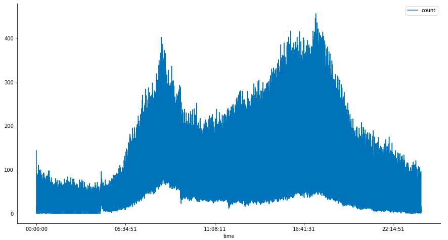
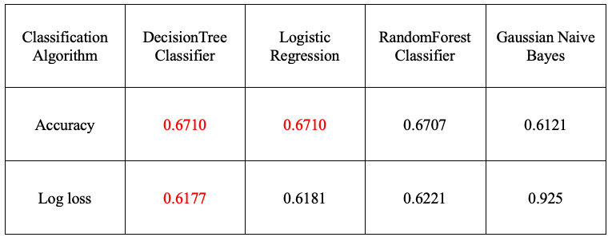

# Introduction: 
Accidents keep happening everyday and some of them which happen due to the surrounding conditions of the vehicle could be avoided if the driver was alerted to maintain a safe speed depending upon the realtime conditions.

Problem is to find out the probability of occurrence of an accident and the severity of it, based on the factors like weather, Road condition, Light condition, Address type(Intersection, Block, Alley). These features would be used to create a classifier that would classify the severity of an accident and gives the probability of the occurance of that accident.

This model would help the drivers to maintain the safe speed while driving, depending upon the realtime conditions, keeping the probability and the severity at minimum. Depending upon the severity and the probability, the recommended speeds could be tuned to the conditions and then suggested to the drivers.

# Data Pre-processing:
The [accident dataset](https://s3.us.cloud-object-storage.appdomain.cloud/cf-courses-data/CognitiveClass/DP0701EN/version-2/Data-Collisions.csv) which has been provided in this course in week1, is being used here. This dataset contains the accidents happened in the city of Seattle,which were recorded by the SPD.

New dataframe is created with only the features being used in the model, which are
’SEVERITYCODE','WEATHER','ROADCOND','LIGHTCOND','ADDRTYPE'

Then the samples with NaN and 'Unknown' values are dropped from the dataframe resulting in the the dataframe with 169781 samples.

Head of the training data:

This data is then encoded using one hot encoding, for classification and a separate feature would be created for each category in every primary feature.

Those categories are 

Feature: WEATHER  
Categories: 10  
'Overcast' 'Raining' 'Clear' 'Snowing' 'Other' 'Fog/Smog/Smoke' 'Sleet/Hail/Freezing Rain' 'Blowing Sand/Dirt' 'Severe Crosswind' 'Partly Cloudy'

Feature: ROADCOND  
Categories: 8  
'Wet' 'Dry' 'Snow/Slush' 'Ice' 'Other' 'Sand/Mud/Dirt' 'Standing Water' 'Oil'

Feature: LIGHTCOND  
Categories: 8  
'Daylight' 'Dark - Street Lights On' 'Dark - No Street Lights' 'Dusk' 'Dawn' 'Dark - Street Lights Off' 'Other' 'Dark - Unknown Lighting'

Feature: ADDRTYPE  
Categories: 3  
'Intersection' 'Block' 'Alley'

In the end, the dataframe consists of 169781 samples and 26 features(26,as one category is being dropped from every primary feature because every other category in that particular primary feature being zero would represent the dropped category and this would decraese the runtime of the model).

Head of the final dataframe:(could only show some features as it contains many features)

# EDA:
As you can see accidents are at peak in the morining and the eveining as that's when most of the people go to work and back to home. Those are the busiest times in the day.

# Methodology:
Classification is being used here to predict the severity of the accident(1,2) based on the one hot encodeded features.
80 percennt of the samples are being used to train the model and split was done by train_test_split from sklearn library.
DecisionTree Classsifier, Logistic Regression, RandomForestClassifier, Guassian Naive Bayes algorithms from sklearn library are being used here.

DecisionTree Classsifier with a max depth of 1 - 10 was fitted with train data and max depth of 4 was most accurate in the provided range, with an accuracy of 67.1%

