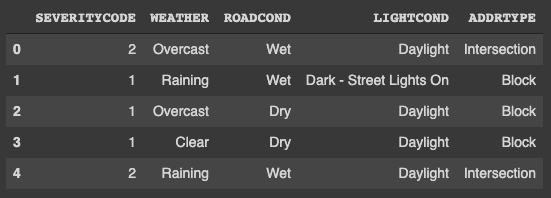
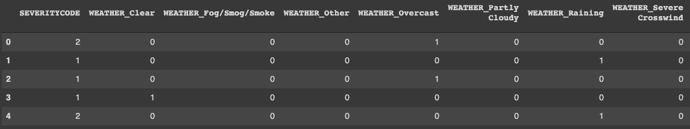

# Introduction: 
Accidents keep happening everyday and some of them which happen due to the weather conditions could be avoided if the driver was alerted to maintain a safe speed depending upon the realtime conditions.

Problem is to find out the probability of occurrence of accident and the severity of the accident, based on the factors like weather, Road condition, Light condition, Address type(Intersection, Block, Alley). These feature would be used to create a classifier that would classify the severity of the accidnet and give the probability of that severity.

This model would help the drivers to maintain the safe speed while driving, depending upon the realtime conditions, keeping the probability and the severity at minimum. Depending upon the severity and the probability, the recommended speeds could be tuned to the conditions and then suggested to the drivers.

# Data:
The accident [dataset](https://s3.us.cloud-object-storage.appdomain.cloud/cf-courses-data/CognitiveClass/DP0701EN/version-2/Data-Collisions.csv) which has been provided in this course in week1, is being used here. 

New dataframe is created with only the features being used in the model, which are
’SEVERITYCODE','WEATHER','ROADCOND','LIGHTCOND','ADDRTYPE'

Head of the training data:

This data is then encoded using one hot encoding, for classification and a separate feature would be created for each category in every primary feature.

Those categories are 

Feature: WEATHER  
Categories: 10  
'Overcast' 'Raining' 'Clear' 'Snowing' 'Other' 'Fog/Smog/Smoke' 'Sleet/Hail/Freezing Rain' 'Blowing Sand/Dirt' 'Severe Crosswind' 'Partly Cloudy'

Feature: ROADCOND  
Categories: 8  
'Wet' 'Dry' 'Snow/Slush' 'Ice' 'Other' 'Sand/Mud/Dirt' 'Standing Water' 'Oil'

Feature: LIGHTCOND  
Categories: 8  
'Daylight' 'Dark - Street Lights On' 'Dark - No Street Lights' 'Dusk' 'Dawn' 'Dark - Street Lights Off' 'Other' 'Dark - Unknown Lighting'

Feature: ADDRTYPE  
Categories: 3  
'Intersection' 'Block' 'Alley'

In the end, the dataframe consists of 169781 samples and 26 features(26,as one category is being dropped from every primary feature because every other category in that particular primary feature being zero would represent the dropped category and this would decraese the runtime of the model).

Head of the final dataframe:(could only show some features as it contains many features)

